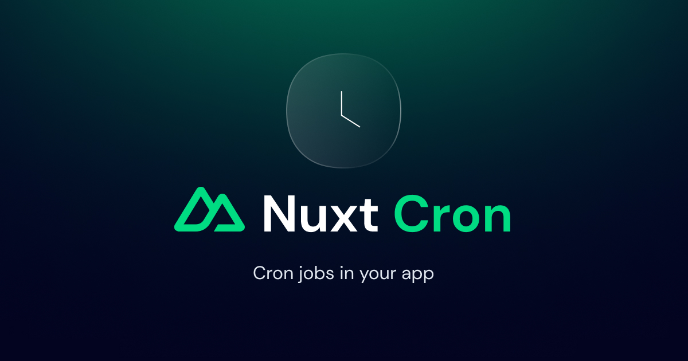

# [⚠️ WIP] Nuxt Cron

[![npm version][npm-version-src]][npm-version-href]
[![npm downloads][npm-downloads-src]][npm-downloads-href]
[![License][license-src]][license-href]
[![Nuxt][nuxt-src]][nuxt-href]

A Nuxt module for cron job in your app.

- [📖 Documentation](#)
- [🏀 Playground](#)
- [✨ Releases](#)

## Features

- 👌&nbsp; 19 time presets
- 🕔️&nbsp; Time zone support
- 🪄️&nbsp; TypeScript support
- ✨&nbsp; Auto imports enabled
- 📦&nbsp; Extendable by [Nuxt modules](https://nuxt.com/modules)

## Installation

```bash
# Using pnpm
pnpm add nuxt-cron

# Using yarn
yarn add nuxt-cron

# Using npm
npm install nuxt-cron
```

## Usage

### Setup

Add `nuxt-cron` to the `modules` section of `nuxt.config.ts`

```js
export default defineNuxtConfig({
  modules: [
    'nuxt-cron'
  ]
})
```

### Configuration

You can configure the module by adding a `nuxt-cron` section to your nuxt.config file.
```js
export default defineNuxtConfig({
  cron: {
    runOnInit: true,
    timeZone: 'Africa/Abidjan',
    jobsDir: 'cron'
  }
})
```

by default, `nuxt-cron` will auto-import your cron from the models directory from server directory. You can change this behavior by setting the `jobsDir` option.

## API

### defineCronHandler

This function creates a new cron job. Example usage:

```js
export default defineCronHandler('everySecond', () => {
  console.log('I run every seconds')
})
```

or use with params:

```js
export default defineCronHandler('everySecond', () => {
  console.log('I run every seconds')
}, { 
    runOnInit: true,
    timeZone: 'Africa/Abidjan'
})
```


<!-- Badges -->
[npm-version-src]: https://img.shields.io/npm/v/nuxt-cron/latest.svg?style=flat&colorA=18181B&colorB=28CF8D
[npm-version-href]: https://npmjs.com/package/nuxt-cron

[npm-downloads-src]: https://img.shields.io/npm/dm/nuxt-cron.svg?style=flat&colorA=18181B&colorB=28CF8D
[npm-downloads-href]: https://npmjs.com/package/nuxt-cron

[license-src]: https://img.shields.io/npm/l/nuxt-cron.svg?style=flat&colorA=18181B&colorB=28CF8D
[license-href]: https://npmjs.com/package/nuxt-cron

[nuxt-src]: https://img.shields.io/badge/Nuxt-18181B?logo=nuxt.js
[nuxt-href]: https://nuxt.com
